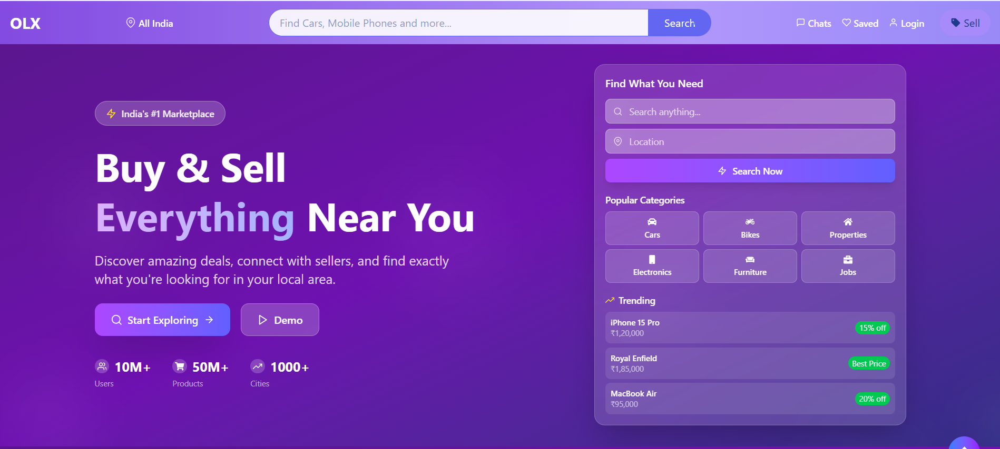
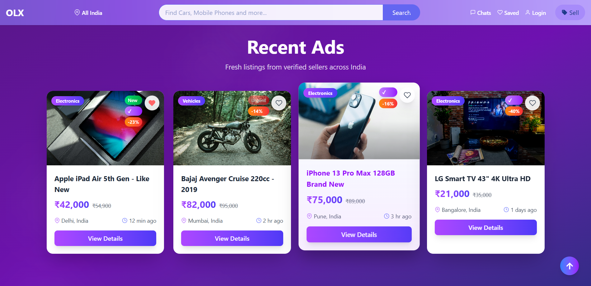
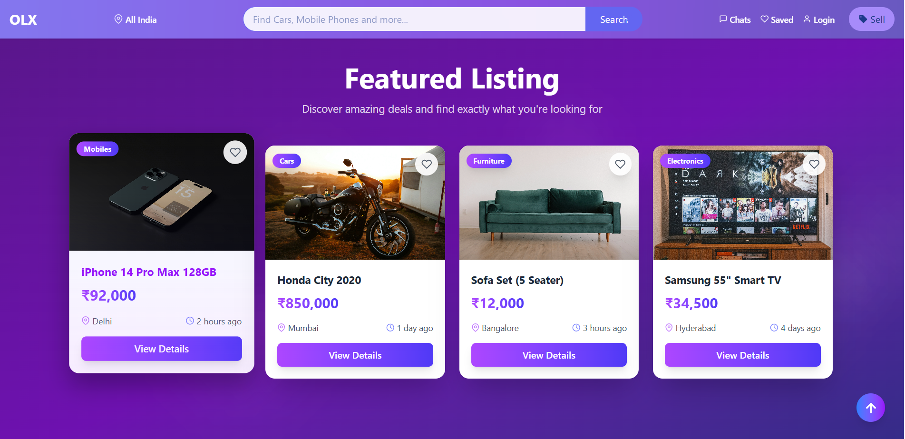
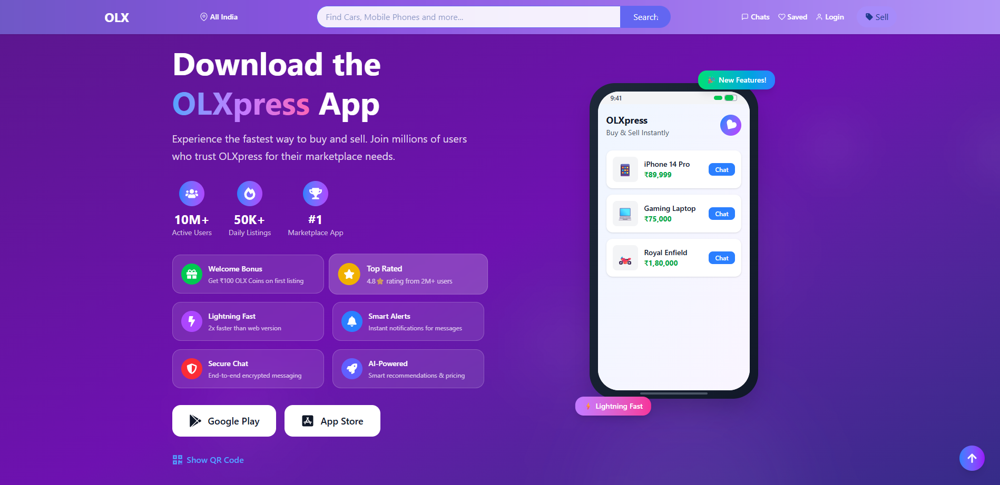

<h1 align="center">📦 OLXpress - Buy & Sell Anything, Anywhere</h1>

<p align="center">
  
  
  
</p>

---

## 🌍 Live Demo

🧑‍💻 Check it Out:  
🔗 https://olxpress.vercel.app/

---

## 🖥️ Project Overview

**OLXpress** is a modern online classifieds platform that lets users buy, sell, and explore listings across categories like electronics, vehicles, fashion, and more. It features responsive design, immersive user experience, and clean UI built using **React**, **TailwindCSS**, and **Framer Motion**.

---

## 📚 Project Sections Overview

- 🎯 **Hero Section**  
  Engaging top banner with CTA and animated intro using Framer Motion.

- 🛍️ **Recent Ads**  
  Displays latest ads with interactive cards, badges, and quick view modal.

- 🌟 **Featured Listings**  
  Highlighted ads with filters (category, price, location), sort options, and Swiper image carousel.

- 🤝 **Why Choose Us**  
  Key highlights of the platform using icons and animation to build user trust.

- 📱 **Download App**  
  Promotional section for mobile app with responsive layout and download badges.

- 🔗 **Footer**  
  Contains navigation, contact info, social links, and brand logo with smooth hover effects.

---

## 🛠️ Tools & Technologies Used

<p align="center">
  
  
  
  
  
</p>

---

## 📸 Screenshots

<div align="center">
  
  
  
  
</div>

---

## ⚙️ How to Run Locally

```bash

# 1. Clone the repo
git clone https://github.com/samjaiswal51/OLXpress.git
cd OLXpress

# 2. Install dependencies
npm install

# 3. Start the server
npm run dev

```
---

## 🙌 Let's Connect

<p align="center"> <a href="https://github.com/samjaiswal51" target="_blank">  </a> <a href="https://www.linkedin.com/in/samarth-jaiswal-72b67b313/" target="_blank">  </a> <a href="https://leetcode.com/samjaiswal51" target="_blank">  </a> <a href="https://www.hackerrank.com/samjaiswal51" target="_blank">  </a> </p>

---

## 🧪 Project Note
This project was built as part of frontend practice to master UI/UX design patterns, animations, filtering systems, and modern marketplace layout using React, Tailwind, and Framer Motion.

---

## 🪄 Want to Contribute?
Feel free to fork, suggest changes, or contribute to this repository.
Star ⭐ this repo if it helped you!
